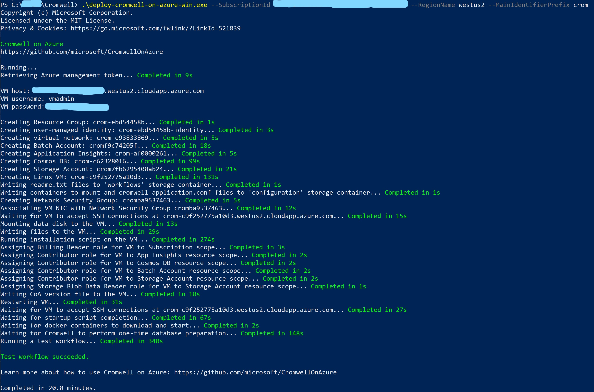
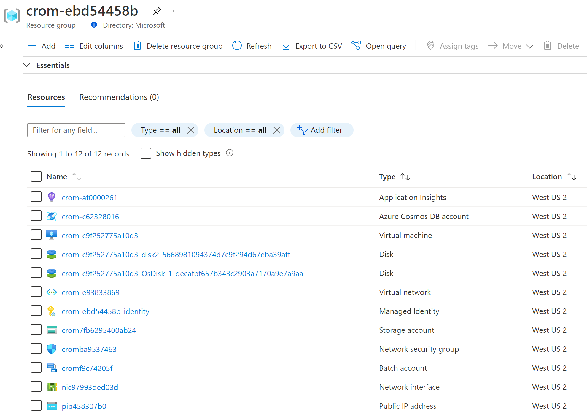

# Overview

Processing genomic data is not a monolithic task, instead it's broken down into smaller dependent tasks that are run using different tools. These tasks are usually chained together to form a pipeline that is then run using on-prem or cloud based clusters.

In order to ensure reproducibility and consistency in the pipeline output, some common best practices and standards have evolved over time. One of the most popular is the [GATK](https://gatk.broadinstitute.org/hc/en-us) from the [Broad Institute](https://www.broadinstitute.org/). There are a couple of specific pipelines that are captured in the GATK, for our discussion we'll focus on the two most commonly used: **Germline short variant discovery(SNVs + Indels)** and **Somatic short variant discovery (SNVs + Indel)**.

To highlight the complexity, here's an example of the tasks/processes that run during the execution of these pipelines.

Germline

[Credit: Broad Institute][1]

Somatic

[Credit: Broad Institute][2]

# Cromwell on Azure..
As you can see from the illustrations above, processing genomic data is fairly complex task. To add to the complexity, these tools usually have their own compute and runtime dependencies. This complexity in process has been compounded by the massive increase in data as genomics becomes more extensively used in clinical, research and pharma settings. 

Scaling these systems, making sure researchers have the right type and amount of compute when needed led to a need to decouple the workflow definition from the compute required to execute them. This led to the growth of sytems like [Cromwell](https://github.com/broadinstitute/cromwell) which came out of work at the [Broad Institute](https://www.broadinstitute.org/). **Cromwell** is an open-source Workflow Management System for bioinformatics. 

[Cromwell on Azure](https://github.com/microsoft/CromwellOnAzure#Cromwell-on-Azure) is an open source implementation of **Cromwell** that allows you to run it natively on Azure. **Cromwell on Azure** uses the [GA4GH](https://github.com/ga4gh/wiki/wiki) **Task Execution Service (TES)** backend. To make managing compute easier, **Cromwell on Azure** orchestrates dynamic provisioning of compute resources via [Azure Batch](https://azure.microsoft.com/en-us/services/batch/). As you scale up your workflows, the compute needed dynamically scales up to handle the increased load.

Crowmwell on Azure

## Running Cromwell on Azure

Step-by-step links to setup **Cromwell on Azure** in your Azure environment. When this section is complete, you will have Cromwell running on your Azure environment and a test flow **Hello World WDL test** ran successfully. 

- What is [Cromwell on Azure](https://github.com/microsoft/CromwellOnAzure#cromwell-on-azure)?
- Steps to [Deploy your instance of Cromwell on Azure](https://github.com/microsoft/CromwellOnAzure#deploy-your-instance-of-cromwell-on-azure)
    - [Prerequisites](https://github.com/microsoft/CromwellOnAzure#prerequisites) to deploy Cromwell
    - [Download the deployment executable](https://github.com/microsoft/CromwellOnAzure#download-the-deployment-executable). **NOTE** Choose the latest and right runtime for your machine.
      **NOTE** Check out the Optional section if you want to build the executable yourself.
    - [Run the deployment executable](https://github.com/microsoft/CromwellOnAzure#run-the-deployment-executable). **NOTE** Open PowerShell, log in using `Az Login`, navigate to the folder where the executable was downloaded, then run the `./deploy-cromwell-on-azure-win.exe` command./n
    Deployment takes ~20 minutes.
    /n
    When complete, you will see these resources in Azure,
    
- "Hello World" workflow is automatically run as a check. In your default storage account,
    - Input files including `test.wdl`, `inputFile.txt`and `testInputs.json` are found in `inputs/test` container 
    - Output files are found in `cromwell-executions` container
    - After completion, the trigger JSON will be in `workflows` container in `succeeded` directory.

## Running Germline alignment and variant calling pipeline on Azure
Germline alignment and variant calling pipeline on Azure(https://github.com/microsoft/gatk4-genome-processing-pipeline-azure#germline-alignment-and-variant-calling-pipeline-on-azure)

## Running Somatic short variant analysis pipeline on Azure
Somatic short variant analysis pipeline on Azure(https://github.com/microsoft/gatk4-somatic-snvs-indels-azure#somatic-short-variant-analysis-pipeline-on-azure)

## Additional Resources

[1]: https://gatk.broadinstitute.org/hc/en-us/articles/360035535932-Germline-short-variant-discovery-SNPs-Indels-
[2]: https://gatk.broadinstitute.org/hc/en-us/articles/360035894731-Somatic-short-variant-discovery-SNVs-Indels-

